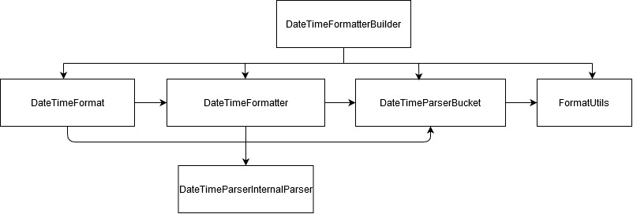

**Part 1**

**Part 1.1 Architecture of 3 packages and 10 classes**

Package: src.main.java.orga.joda.time.tz
We chose this package because it contains the main entry point

Package: src.main.java.orga.joda.time.convert
The class ConverterManager was chosen as an entry point because it initializes all the different converters types. These converters in turn are all based on the AbstractConverter class, which acts as a common basis.

Package: src.main.java.orga.joda.time.format

**Part 1.2 Call Graph**

Call Graph: If the class is not indicated, the call happens inside the same class

**Part 2**

ZoneInfoCompiler.parseTime
If/else

ZoneInfoCompiler.formatName
If/else

DateTimeZoneBuilder.writeMillis
If/else

ZoneInfoProvider.openResource
If/else

ZoneInfoProvider.readZoneInfoMap
For-loop

.jpg "readZoneInfoMap")

DateTimeZoneBuilder.isCachable
For-loop

